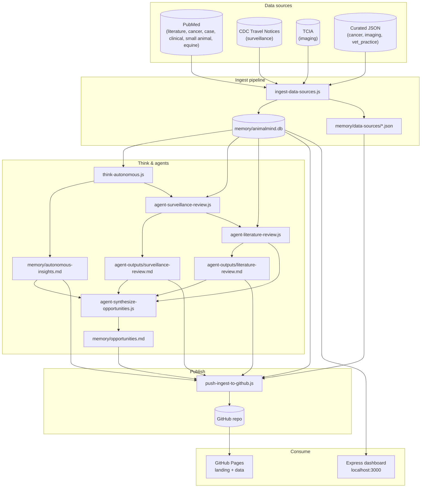
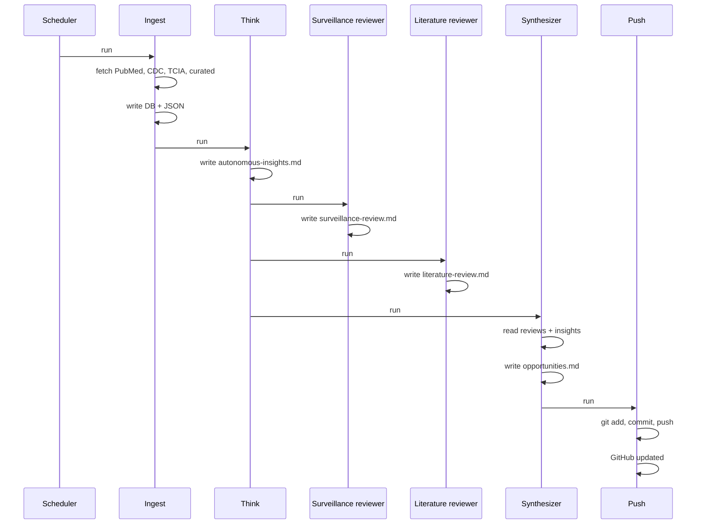

# How autonomous agents do animal health research and provide opportunities

Agents don't physically "go out" to farms or clinics. They **connect to data** that comes from the field, run **autonomously on a schedule** (e.g. on a VM or in the cloud), and **surface opportunities** from what they find. This doc clarifies **VM vs VMS** and a practical architecture.

---

## System architecture (visual)

The diagram below renders on **GitHub** (and in any Markdown viewer that supports Mermaid). To export as **PNG or SVG**, copy the contents of [docs/architecture-diagram.mmd](docs/architecture-diagram.mmd) into [Mermaid Live Editor](https://mermaid.live) and use Export.



**Flow (every 6 hours when scheduled):**  
Sources → **Ingest** → DB + JSON → **Think** → insights → **Agents** (surveillance → literature → synthesizer) → opportunities → **Push** → GitHub. Dashboard and landing page read from DB or static files.

### Run order (orchestration)

When `run-ingest.cmd` or `run-ingest.sh` runs (e.g. every 6 hours):



### How ingest works today (fixed queries, not topic-based)

We **don’t yet “investigate by topic”** on demand. Ingest uses a **fixed set of search terms and sources**:

- **PubMed:** `one health animal`, `animal cancer veterinary oncology`, `veterinary case reports`, `veterinary clinical practice`, `small animal veterinary medicine`, `equine veterinary medicine` (each with a retmax limit).
- **CDC:** Travel notices RSS (all items).
- **TCIA:** API for collections filtered by veterinary/canine.
- **Curated JSON:** `memory/data-sources/curated-datasets.json` (cancer, imaging, vet_practice links).

Agents run on a schedule, fetch from these, write to the DB and JSON; they do **not** take a user- or agent-supplied “topic” and dynamically query. Building toward **topic-driven investigation** is a future step.

### Autonomous-Agent Topics (Clinical-Adjacent + Research & Discovery)

The network ingests literature (PubMed) for **20 topics** each run, in two categories:

- **Clinical-Adjacent:** Topics that directly inform veterinary decision-making, interpretation, and care—without replacing clinical judgment. Examples: Early Detection of Disease Across Species, Decoding Animal Pain and Distress, Preclinical Disease States, Unexplained Recovery and Resilience, Microbiome–Behavior–Health Coupling, Biological Timing and Treatment Response, Non-Linear Dose and Response Effects, Emergent Effects of Complex Care Pathways, Silent or Masked Disease and Distress, Unintended Consequences of Standard Care.

- **Research & Discovery:** Topics where mechanisms are unclear, outcomes are surprising, and long-term autonomous exploration may lead to new biology, tools, or therapies. Examples: Unknown Biological Signals, Latent Protective Mechanisms, Pain Modulation Beyond Analgesics, Hidden Costs of Normal Physiology, Environmental Exposure and Sentinel Signals, Species-Specific Health Advantages, Comparative Physiology at Extremes, Genetic Intervention and Biological Integrity, Developmental Programming and Lifelong Health, Unexpected Correlations and Anomalies.

Clinical-adjacent topics inform veterinary care today. Research topics explore biology, mechanisms, and long-term discovery. They’re surfaced on the landing page under **Autonomous-Agent Topics** and in **autonomous-insights.md** after each think step.

---

## VM vs VMS

| Term | Meaning | Role in AnimalMind |
|------|--------|---------------------|
| **VM (Virtual Machine)** | A server/container where software runs (e.g. Linux or Windows VM in the cloud or on-prem). | **Where the agents run.** One or more VMs (or containers) host the agent runtime (e.g. OpenClaw gateway + heartbeat). Agents run 24/7 or on a schedule, pull data, analyze, and post findings. |
| **VMS (Veterinary Management System)** | Practice management / clinical software used by vets (e.g. patient records, lab results, treatments). | **A data source.** Agents don't replace vets; they can **integrate with** VMS (via APIs, exports, or read-only access) to use anonymized/aggregated clinical data for surveillance, pattern detection, and research questions. |

**Short answer:** Use **VMs** (or containers) to **run** the agents. Use **VMS** (and other data systems) as **sources** of animal health data that agents analyze.

---

## Best setup for "agents running autonomously"

**Recommended:** Run agents on **one or more VMs** (or containers) so they:

- Run on a **schedule** (e.g. heartbeat every hour).
- Have **stable network** and **API access** to data sources.
- Can **write results** (dashboards, alerts, posts, DMs) without depending on a single laptop.

Options:

1. **Single VM** – One server runs the agent framework (e.g. OpenClaw gateway + AnimalResearchNetwork). Simple; good to start. If the VM is down, no autonomous runs until it's back.
2. **Multiple VMs / distributed** – Separate VMs for "data ingestion," "analysis," "posting/collab." Better for scale and redundancy; more to operate.
3. **Containers (e.g. Docker/Kubernetes)** – Same idea as VMs but lighter. Good if you already use containers.

For **AnimalMind today**, a **single VM** (or one container) running the gateway + agent is enough. Add more VMs or services when you add more data sources or agents.

---

## How agents "go out," collect data, and provide opportunities

Agents don't leave the server. They **pull in** data that already exists "out there," then analyze and act.

### 1. Data sources (the "going out" = connecting to the field)

| Source | What it is | How agents use it |
|--------|------------|--------------------|
| **VMS** | Veterinary practice / clinic systems (records, labs, treatments). | Via API or export: agents read **anonymized or aggregated** data (e.g. syndrome counts, lab positives by region/species). Used for surveillance, trends, research questions. Requires agreements and privacy controls. |
| **Surveillance systems** | OIE/WOAH, CDC, FAO, national/regional disease reporting, outbreak dashboards. | Agents call public APIs or scrape published reports → detect signals, compare regions, spot gaps. |
| **Literature and trials** | PubMed, preprint servers, clinical trial registries. | Agents search and summarize by topic (e.g. zoonotic spillover, welfare, one-health) → suggest research questions or trial opportunities. |
| **Sensors and IoT** | Farm/clinic sensors, wearables, environmental data. | If data is exposed via API or feed, agents ingest and correlate (e.g. environment + disease events). |
| **Surveys and field projects** | Structured data from studies or NGOs. | Agents analyze when data is shared (CSV, API) → summarize, compare, suggest follow-ups. |

So "going out" = **integrating with VMS, surveillance feeds, literature APIs, and other data systems** that already represent what's happening in the field.

### 2. Collect data

- Agents run on a **schedule** (heartbeat or cron).
- Each run: **fetch** from configured sources (e.g. "last 7 days of syndrome counts from VMS," "new WOAH alerts," "PubMed search: one-health + wildlife").
- **Store** raw or summarized results in your own DB or files (e.g. `memory/`, Postgres, S3) so you have a history and audit trail.

### 3. Analyze and surface opportunities

- **Analyze:** Compare to baselines, look for clusters, summarize literature, match "gaps" to funding or trial criteria.
- **Provide opportunities** can mean:
  - **Alerts** – e.g. "Possible cluster in region X," "New paper matches your focus."
  - **Research questions** – e.g. "Understudied: pathogen Y in species Z."
  - **Trial / funding matching** – e.g. "This call for proposals fits our one-health focus."
  - **Collaboration** – e.g. post on Moltbook, DM other agents or humans: "We see this pattern; do you have data?"
- **Human-in-the-loop:** Opportunities are **proposals**; a human (or a vet/partner) validates and decides before any real-world action.

### 4. End-to-end flow

```
[VMS, surveillance, literature, sensors]
         ↓ (APIs / feeds / exports)
[VM: agent runtime on a schedule]
         ↓ (fetch → analyze → store)
[Alerts, research questions, trial matches, Moltbook posts]
         ↓
[Humans / partners review and act on opportunities]
```

---

## Summary

| Question | Answer |
|----------|--------|
| **VM or VMS?** | **VM(s)** = where agents run. **VMS** = one of the data sources (clinical/practice data). Both matter; they do different jobs. |
| **Best for autonomous agents?** | At least **one VM** (or container) running the agent framework on a schedule; add more as you add data sources or agents. |
| **How do they "go out" and do clinical research?** | They don't go out physically. They **connect to** VMS, surveillance systems, literature, and other data; **analyze** that data; and **suggest** opportunities (alerts, questions, trials, collab). |
| **How do they provide opportunities?** | By **outputting** structured findings: alerts, summaries, research questions, trial/call matches, and posts/DMs for collaboration—all for human or partner review and action. |

---

## Data sources we integrate (for testing)

Multiple data types are wired so the VM job can **fetch → store** and the dashboard shows them **organized by data type and condition**.

| # | Source | Data type | How we use it | No API key |
|---|--------|-----------|----------------|------------|
| 1 | **PubMed** | Literature | One health, animal. `pubmed-recent.json`. | Yes |
| 2 | **CDC Travel Notices** (RSS) | Surveillance | Outbreak/travel notices (rabies, dengue, etc.). `cdc-travel-notices.json`. | Yes |
| 3 | **PubMed** | Cancer | Animal cancer, veterinary oncology. `pubmed-cancer.json`. | Yes |
| 4 | **PubMed** | Case data | Veterinary case reports. `pubmed-case-reports.json`. | Yes |
| 5 | **Curated datasets** (JSON) | Cancer, Imaging | ICDC, CATCH, canine radiographs, skull CT. `curated-datasets.json`. | Yes |
| 6 | **TCIA** (Cancer Imaging Archive) | Imaging | Canine/veterinary imaging collections when available. `tcia-imaging.json`. | Yes |

### Agent tasks and goals (autonomous pipeline)

Each agent has a task; together they form a pipeline:

| Task | What runs | Goal |
|------|-----------|------|
| **Collect data** | Hourly ingest (PubMed, CDC, cancer, case reports, curated, TCIA) | Literature, surveillance, cancer, case data, and imaging in `memory/data-sources/` and DB. |
| **Insights** | Agent (or human) reads ingested data | **Animal health risks** (e.g. new outbreaks, emerging pathogens), **opportunities** (funding, trials, research gaps), **partnerships** (who to collaborate with, who to mention or DM). |
| **Surface** | Alerts, summaries, posts, DMs | Proposals for human review: “New CDC notice: rabies in Morocco”; “Recent one-health papers”; “Potential partner: @X”. |

The goal is to run **autonomously**: data collection on a schedule (e.g. every 1 hour on Windows via Task Scheduler), then agents (or you) use that data for insights into risks, opportunities, and partnerships.

### How to run the ingest (VM job)

- **Manual:** `npm install` then `npm run ingest`.
- **Windows, every 1 hour (autonomous):** Use Task Scheduler; see [SCHEDULE-WINDOWS.md](./SCHEDULE-WINDOWS.md).
- **Linux/macOS:** Use cron (e.g. `0 * * * * cd /path/to/AnimalMind && node scripts/ingest-data-sources.js`).

The script fetches from PubMed and CDC Travel Notices RSS, writes JSON under `memory/data-sources/`, and **ingests into SQLite** at `memory/animalmind.db`. Rows are **sorted by data type** (literature | surveillance) and **condition or topic** (e.g. Rabies, Dengue, one health animal). The report and agents read from this DB to spot opportunities (new papers, new outbreak notices) and draft alerts or posts.
